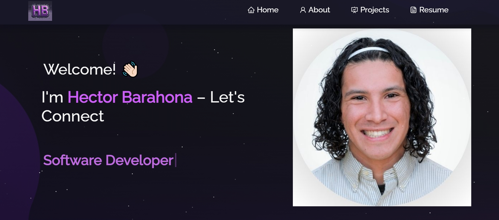

<h2 align="center">
  8BitBarahona - My Portfolio Website 
  <a href="https://8bit-barahona.vercel.app/" target="_blank">HBarahona.tech</a>
</h2>

  

 

 &nbsp;
 &nbsp;
 &nbsp;
<!-- 
 &nbsp;

-->

<!-- 
<h3 align="center">
    🔹
    <a href="https://github.com/soumyajit4419/Portfolio/issues">Report Bug</a> &nbsp; &nbsp;
    🔹
    <a href="https://github.com/soumyajit4419/Portfolio/issues">Request Feature</a>
</h3>
-->

## TL;DR

I forked this portfolio website from [Soumyajit4419](https://github.com/soumyajit4419/Portfolio) and added my own features and customizations to make it unique. This show cases my projects and skills. Check it out at [HBarahona.tech](https://8bit-barahona.vercel.app/)! 🚀  

## Built With

My personal portfolio <a href="https://8bit-barahona.vercel.app/" target="_blank">HBarahona.tech</a> which features some of my github projects as well as my resume and technical skills. 

This project was built using these technologies.

- React.js
- Node.js
- Express.js
- CSS3
- VsCode
- Vercel

## Features

**📖 Multi-Page Layout**

**🎨 Styled with React-Bootstrap and Css with easy to customize colors**

**📱 Fully Responsive**

